# Pipeline

End-to-end flow of `expand.py`: from a YAML of seed papers/researchers to an XLSX with one tab per hiring position.

## Flow

```mermaid
flowchart TD
    A["<b>seeds_fleet.yaml</b><br/>33 papers · 7 researchers"] --> B
    B["<b>Phase 1</b><br/>Resolve seeds<br/>(OpenAlex: DOI + author search)"]
    B -->|"102 papers queued"| C

    C["<b>Phase 2</b> — Graph expansion (BFS, depth=1)<br/>get paper.authorships<br/>get paper.citations<br/>get paper.referenced_works<br/>via OpenAlex"]
    C -->|"1192 papers processed<br/>5096 researchers"| D

    D["<b>Phase 2b</b> — Topic keyword search<br/>OpenAlex /works?search=&lt;kw&gt;<br/>over categories in config"]
    D -->|"+10,063 researchers<br/>= 15,159 total"| E

    E["<b>Phase 3</b> — Career-stage classification<br/>Sonnet 4.5 via OpenRouter<br/>(batch of 20)"]
    E -->|"15,159 labeled"| F

    F["<b>Phase 4</b> — Category-fit classification<br/>Sonnet 4.5 via OpenRouter<br/>(batch of 15)"]
    F -->|"15,159 labeled<br/>with per-category fit"| G

    G["<b>Phase 5</b> — Filter<br/>· max_h_index &lt; 40<br/>· career_stage ∈ {phd, recent, junior, mid}<br/>· has ≥ 1 matched category<br/>· not in exclude list"]
    G -->|"~N filtered"| H

    H["<b>Phase 6</b> — Profile enrichment<br/>OpenAlex /authors?search=&lt;name&gt;<br/>fills h-index, cited-by, institution"]
    H -->|"enriched"| I

    I["<b>Phase 7</b> — Output<br/>combined.csv + one CSV per position<br/><b>researchers.xlsx</b> with a tab per position"]
    I --> J["<b>Phase 8</b> — (optional) Slack upload<br/>files.getUploadURLExternal → complete<br/>→ #hiring"]
```



## Sequence (one seed paper through the graph)

```mermaid
sequenceDiagram
    participant U as User
    participant E as expand.py
    participant OA as OpenAlex
    participant OR as OpenRouter (Sonnet 4.5)
    participant SL as Slack

    U->>E: seeds_fleet.yaml + config_fleet.yaml
    E->>OA: /works/doi:10.48550/arXiv.{id}
    OA-->>E: work + authorships[]
    E->>OA: /works?filter=cites:{work_id} (up to 50)
    OA-->>E: citing papers
    E->>OA: /works/{id}?select=referenced_works
    OA-->>E: reference IDs
    Note over E: BFS: repeat until max_depth
    E->>OA: /works?search=&lt;keyword&gt; (per topic)
    OA-->>E: topic papers → authors
    E->>OR: classify career_stage (batch 20)
    OR-->>E: {stage} per researcher
    E->>OR: classify category_fit (batch 15)
    OR-->>E: {scores} per category
    Note over E: filter + enrich (OpenAlex /authors)
    E->>OA: /authors?search=&lt;name&gt;
    OA-->>E: h_index, cited_by, institution
    E-->>U: data/expand_output/researchers.xlsx
    E->>SL: files.getUploadURLExternal + complete
    SL-->>U: file in #hiring
```

## Latest run counts (2026-07-06)

Config: `seeds_fleet.yaml` + `config_fleet.yaml`, `--max-depth 1 --skip-emails`.

| Phase | In | Added | Total after |
|---|---:|---:|---:|
| 1. Seeds | 33 papers + 7 researchers | 102 papers queued | — |
| 2. BFS (depth=1) | 102 papers | 1192 papers visited | **5,096 researchers** |
| 2b. Topic keywords — *World Models* | — | 4,113 | 9,209 |
| 2b. Topic keywords — *Agentic Benchmarks* | — | 3,863 | 13,072 |
| 2b. Topic keywords — *STEM Benchmarks* | — | 425 | 13,497 |
| 2b. Topic keywords — *Environment Generation* | — | 1,662 | **15,159** |
| 3. Career stage (LLM) | 15,159 | (label only) | 15,159 |
| 4. Category fit (LLM) | 15,159 | (label only) | 15,159 |
| 5. Filter | 15,159 | — | *pending* |
| 6. OpenAlex enrichment | *pending* | h-index, institution | *pending* |
| 7. Output | *pending* | — | `researchers.xlsx` |

Topic-search added **~2× more researchers than the BFS itself** (10,063 vs 5,096). Most of the LLM cost is spent on Phase 2b candidates that will be dropped in Phase 5. If Phase 5's filter kill rate is high, `--skip-topics` becomes attractive for the weekly cron.

Per-keyword breakdown (sorted by yield within category):

<details><summary>Show</summary>

**World Models** — 4,113
- world model: 1,016
- learned simulator: 698
- video prediction: 570
- latent dynamics: 491
- model-based reinforcement learning: 440
- action-conditioned video: 420
- joint embedding predictive: 393
- self-supervised video: 85

**Agentic Benchmarks** — 3,863
- agent leaderboard: 712
- browser agent: 417
- function calling benchmark: 413
- GUI agent: 379
- LLM-as-judge: 378
- web agent: 367
- agent evaluation: 358
- desktop agent: 347
- agent benchmark: 229
- tool-use benchmark: 200
- coding agent benchmark: 63

**STEM Benchmarks** — 425
- math benchmark: 240
- competition math: 125
- science benchmark: 51
- code benchmark: 9
- (7 keywords returned 0 new: STEM evaluation, mathematical reasoning, scientific reasoning, chemistry benchmark, biology benchmark, code generation evaluation, formal verification benchmark, olympiad)

**Environment Generation** — 1,662
- sim-to-real: 453
- procedural generation: 347
- robotic simulation generation: 170
- 3D scene generation: 140
- unsupervised environment design: 139
- task generation for RL: 118
- automatic curriculum: 97
- domain randomization: 78
- environment generation: 60
- procedural content generation: 60

</details>

## Weekly cron

Runs Mondays 13:00 UTC via `.github/workflows/weekly.yml`. Same command as above with `--max-depth 2` (once OpenAlex batch fetching lands — see follow-up) and `--slack-channel hiring`. Requires repo secrets: `OPENROUTER_API_KEY`, `SLACK_BOT_TOKEN`.
