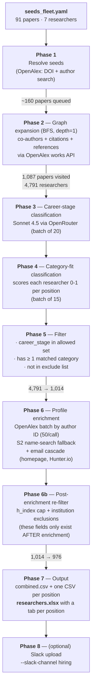
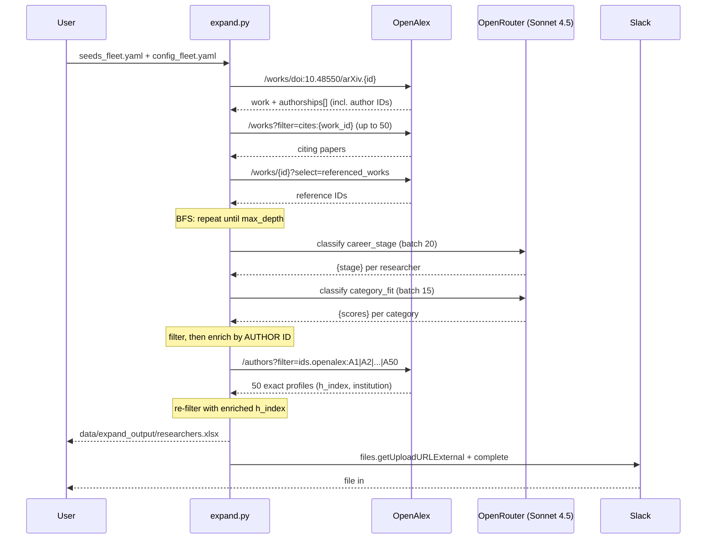

# Pipeline

End-to-end flow of `expand.py`: from a YAML of seed papers/researchers to an XLSX with one tab per hiring position.

Five positions: **World Models, Agentic Benchmarks, STEM Benchmarks, Environment Generation, Post-Training.** Seeds are hand-curated (91 papers + 7 researchers as of 2026-07-08), drawn from the local paper library and Elvis Saravia's weekly recaps, with every arxiv ID verified against OpenAlex before committing.

## Flow

## Sequence (one seed paper through the graph)

## Latest run counts (2026-07-08)

Config: `seeds_fleet.yaml` (91 papers, 7 researchers) + `config_fleet.yaml`, `--max-depth 1`.

| Phase | Result |
|---|---|
| 1. Seeds | 91 papers + 7 researchers resolved |
| 2. BFS (depth=1) | 1,087 papers visited → **4,791 researchers** |
| 3–4. LLM labels | 4,791 researchers × (career stage + 5-category fit) |
| 5. Filter | 4,791 → **1,014** (removed: 2,637 no-category, 1,134 wrong stage, 6 excluded org) |
| 6. Enrichment | 942 by author-ID batch (~20 s) + 66 name-fallback; 597 emails |
| 6b. Re-filter | 1,014 → **976** (37 h≥40, 1 excluded institution) |
| 7. Output | xlsx tabs: WM 159 · AB 428 · STEM 280 · EG 156 · PT 280 |

Field coverage in the final sheet: h-index 69%, institution 66%, email 59%, homepage 42%.

## Design decisions

- **Topic keyword search removed (2026-07-07).** Phase 2b used to fan OpenAlex keyword searches across category keywords. It generated 10K candidates of which 99%+ were filtered as no-category — pure LLM cost. Category `keywords:` in the config are now empty; category **names** still drive Phase 4 classification and the xlsx tabs.
- **Enrichment is by OpenAlex author ID, not name search.** Author IDs are captured from `authorships` during the BFS walk, so they identify the exact person on the paper. Name search top-hits the most-cited person with that display name — that's how a biotech "Chao Wang" (h=100) landed in the Post-Training tab. Batching 50 IDs per call fetches ~950 profiles in ~20 seconds. Name search (OpenAlex → Semantic Scholar) survives only as a fallback for rows without an ID, guarded by a shared-name-token check.
- **Filters run twice.** Career stage and category fit are filterable right after classification (Phase 5), but `max_h_index` and institution exclusions depend on enrichment output, so Phase 6b re-applies them. Skipping this is how h=100 seniors leaked into an h<40 sheet.
- **429s never retry within a call.** OpenAlex enforces IP-level rate shaping: one 429 means the next request will 429 too, so retrying just burns the 15-minute client-side cooldown repeatedly. On 429 the call returns None immediately and the caller falls back to the other engine (OpenAlex ↔ S2). Sustained rate is capped at 2 RPS across ALL callers by the shared `oa_throttle` module.
- **max_depth=1.** Depth 2 with the current fan-out (50 citations + 30 references per paper) queues 100K+ papers — days of API time. Revisit only with OpenAlex batch works-fetching in place.
- **Everything is cached** (`data/*.json`): graph state, LLM labels, profiles by ID, emails including misses. `--resume` re-runs only what's new; a weekly run costs only the delta.

## Weekly cron

`.github/workflows/weekly.yml` — Mondays 13:00 UTC. Runs the full pipeline, uploads the xlsx as an artifact, optionally posts to `#hiring` (needs `SLACK_BOT_TOKEN` secret + the bot invited to the channel), and commits refreshed caches back to the repo. Manual trigger: Actions → weekly-researcher-discovery → Run workflow.
