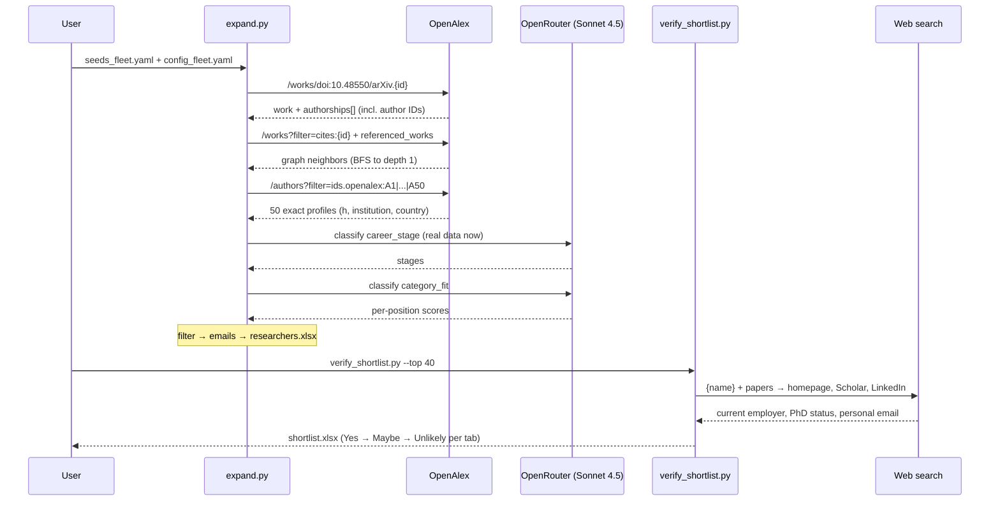

# Pipeline

Two-layer output from one pipeline: a **wide candidate pool** (`researchers.xlsx`, hundreds per position) and a **web-verified recruiter shortlist** (`shortlist.xlsx`, top 40 per position in the proven 7-column format).

Six positions: **World Models, Agentic Benchmarks, STEM Benchmarks, Benchmarks (model cards, added 2026-08-29), Environment Generation, Post-Training.** Seeds are hand-curated (280 papers + 7 researchers as of 2026-08-29), every arxiv ID verified against OpenAlex before committing (two exceptions flagged inline in seeds_fleet.yaml: IFBench and LiveCodeBench Pro are on arxiv but OpenAlex indexes only their NeurIPS-proceedings DOIs, so they log a resolve warning).

## Flow

```mermaid
flowchart TD
    A["<b>seeds_fleet.yaml</b><br/>92 papers · 7 researchers"] --> B
    B["<b>Phase 1</b> — Resolve seeds<br/>(OpenAlex: DOI + author search)"]
    B --> C

    C["<b>Phase 2</b> — Graph expansion (BFS, depth=1)<br/>first-5 + last-5 authors per paper<br/>(PIs sit LAST on ML papers)<br/>+ citations + references"]
    C -->|"1,090 papers<br/>4,741 researchers"| D

    D["<b>Phase 3</b> — Profile enrichment by author ID<br/>OpenAlex batch, 50 profiles/call<br/>h-index · institution · country<br/>(~90 s for the whole graph)"]
    D --> E

    E["<b>Phase 4</b> — Career-stage classification<br/>Sonnet 4.5, now with REAL profile data<br/>(v1 saw zeros → 71% 'unknown')"]
    E --> F

    F["<b>Phase 5</b> — Category-fit classification<br/>0-1 score per position"]
    F --> G

    G["<b>Phase 6</b> — Filter<br/>DROP: no category · early_phd ·<br/>excluded orgs · non-US/EU/UK/CA country<br/>FLAG: seniors/h≥40 → Stretch ·<br/>OpenAI/Anthropic/DeepMind → Unlikely"]
    G -->|"4,741 → 825"| H

    H["<b>Phase 6b</b> — Fallback enrichment + emails<br/>(survivors only; S2 name-search fallback,<br/>homepage/Hunter.io email cascade)"]
    H --> I

    I["<b>Phase 7</b> — Wide pool output<br/><b>researchers.xlsx</b> · tab per position<br/>sorted Yes → Stretch → Unlikely"]
    I --> J

    J["<b>verify_shortlist.py</b> — top 40 per tab<br/>LLM + live web search per person:<br/>current employer · PhD status ·<br/>personal email · key work · verdict"]
    J -->|"189 confirmed"| K["<b>shortlist.xlsx</b><br/>#, Name, Career Stage, Key Work,<br/>Personal Email, Website, Recruitable?"]
```

## Sequence (one seed paper through the graph)

## Latest run counts (2026-07-08, v2 architecture)

| Phase | Result |
|---|---|
| 1. Seeds | 92 papers + 7 researchers |
| 2. BFS (first+last authors) | 1,090 papers → **4,741 researchers** (PIs now included) |
| 3. ID-batch enrichment | 4,502/4,503 profiles in 87 s |
| 4. Career stage (v2) | 832 early-PhDs, 425 professors identified (v1: 71% unknown) |
| 5. Category fit | 5 positions scored |
| 6. Filter | 4,741 → **825** (dropped: 2,233 no-category, 845 geography, 832 early-PhD, 6 excluded orgs; flagged: 307 Stretch, 10 Unlikely) |
| 6b. Emails | 600/825 (73%) |
| 7. Wide pool | WM 163 · AB 302 · STEM 262 · EG 172 · PT 187 |
| Shortlist | 189/200 identities web-confirmed → `shortlist.xlsx` |

## Design decisions

- **Two layers, one truth.** `researchers.xlsx` is coverage; `shortlist.xlsx` is precision. The previous iteration produced its shortlist inside a chat session that was lost — `verify_shortlist.py` makes that step reproducible code with a per-(person, position) cache.
- **Authors from both ends of the list.** ML papers put PIs last; `authors[:N]` silently dropped exactly the senior authors whose networks we mine. First-5 + last-5 fixes it.
- **Enrich before classifying.** Profile enrichment is by OpenAlex author ID captured from authorships — the exact person, batched 50/call, immune to display-name collisions (the wrong "Chao Wang h=100" bug). Doing it before classification turned the career-stage LLM from 71%-unknown to actually-useful.
- **Names are search keys, IDs are identities.** Name search (OpenAlex or S2) top-hits the most-cited person with that display name; it survives only as a fallback, guarded by a shared-name-token check.
- **Geography is a filter, staleness is a flag.** Known non-US/EU/UK/CA institution countries are dropped (config `allowed_countries`); unknown country is kept as `?` — dropping on missing data would cut ~30% for no signal. OpenAlex affiliations lag reality (people show their alma mater years after moving), which is exactly why the shortlist layer re-checks employers on the live web.
- **Keep and flag seniors.** h≥40 / professors / founders → `recruitable: Stretch`, not deleted: a PI who is interested is very recruitable. OpenAI/Anthropic/DeepMind → `Unlikely`. Tabs sort Yes → Stretch → Unlikely; the shortlist re-sorts by the *verified* verdict, which regularly discovers "actually tenured faculty" or "actually at OpenAI."
- **Topic keyword search removed.** It generated 10K candidates, 99% filtered — pure LLM cost. Category names still drive classification and tabs.
- **429s never retry within a call.** OpenAlex rate-shapes by IP: one 429 means retries also 429, so each retry just burned a fresh 15-min cooldown. On 429: return None, fall back to the other engine (OpenAlex ↔ S2). All callers share one throttle (`oa_throttle.py`, 2 RPS sustained).
- **max_depth=1.** Depth 2 with current fan-out queues 100K+ papers. Revisit only with OpenAlex batch works-fetching.
- **Everything cached** (`data/*.json`): graph state, LLM labels (stage cache versioned v2), profiles by ID, emails incl. misses, web verifications. `--resume` re-runs only the delta.

## Weekly cron

`.github/workflows/weekly.yml` — Mondays 13:00 UTC (also `workflow_dispatch`):
1. `expand.py` → wide pool
2. `verify_shortlist.py --top 40` → shortlist
3. Uploads **both** xlsx as artifacts (90-day retention)
4. Posts `shortlist.xlsx` to `#hiring` (needs the bot invited to the channel)
5. Commits refreshed caches back to the repo

Repo secrets (set 2026-07-08): `OPENROUTER_API_KEY`, `SLACK_BOT_TOKEN`.
